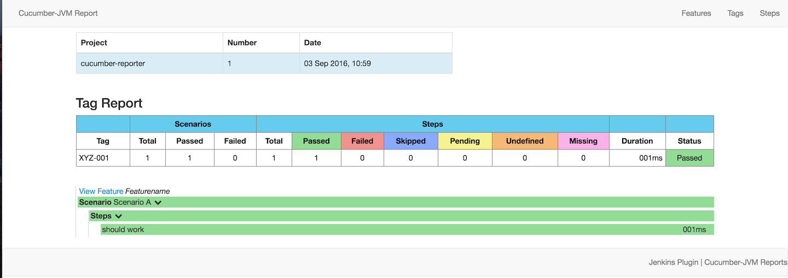

# Karma Cucumber Reporter

Transforms Karma test output to Cucumber format which can be postprocessed by [cucumber-reporting](https://github.com/damianszczepanik/cucumber-reporting).

## Installation

```
npm i -D karma-cucumber-reporter
```

## Usage

Tests have to be written with a specific syntax to be recognized and translated correctly.

```
describe('PREFIX FEATURE', function () {
  describe('SCENARIO A', function () { //... });

  describe('SCENARIO A', function () { //... });
});
```

1. The test is only included if the `PREFIX` string matches with the `prefix` option.

2. There always have to be at least one scenario, i.e. an inner `describe` block.

## Configuration

```
// karma.conf.js
module.exports = function(config) {
  config.set({
    reporters: ['cucumber'],
    // ...
    plugins: [
      // ...
      require('karma-cucumber-reporter'),
    ],
  });
};
```

## Options

### out

**Type:** String

File location to write to. Defaults to `stdout` if not present.

```
// karma.conf.js
module.exports = function(config) {
  config.set({
    reporters: ['cucumber'],
    cucumberReporter: {
      out: './cucumber.json'
    }
  });
};
```

### prefix

**Type:** String

Prefix which indicates that a test should be include in the report.

```
// karma.conf.js
module.exports = function(config) {
  config.set({
    reporters: ['cucumber'],
    cucumberReporter: {
      prefix: 'XYZ'
    }
  });
};
```

## Example

For an example, please have a look at the [examples](examples/) folder. It will produce a report like this when you run `npm test`:


